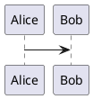

# Phase 5 扩展语法与演示模式 Implementation Plan

> **For agentic workers:** REQUIRED SUB-SKILL: Use superpowers:subagent-driven-development (recommended) or superpowers:executing-plans to implement this plan task-by-task. Steps use checkbox (`- [ ]`) syntax for tracking.

**Goal:** Add PlantUML support, Markmap support, and reveal.js presentation mode to complete Phase 5.

**Architecture:** Extend existing SyntaxBridgeService → rename to CompositeSyntaxBridgeService adding PlantUML/Markmap regex. Extend PreviewRenderService CDN scripts. New PresentationService generates reveal.js HTML. New PresentationScreen plays it in a fullscreen WebView.

**Tech Stack:** Dart, Flutter, WebView, reveal.js CDN, plantuml-encoder CDN, markmap-lib CDN

---

### Task 1: Rename LatexSyntaxBridgeService and add PlantUML/Markmap support

**Files:**
- Modify: `packages/mobile/lib/render/syntax_bridge_service.dart`
- Modify: `packages/mobile/test/render/syntax_bridge_service_test.dart`

- [ ] **Step 1: Write failing tests for PlantUML bridge**

Add these tests to `packages/mobile/test/render/syntax_bridge_service_test.dart`, replacing all `LatexSyntaxBridgeService` references with `CompositeSyntaxBridgeService`:

```dart
import 'package:flutter_test/flutter_test.dart';
import 'package:mindflow/render/syntax_bridge_service.dart';

void main() {
  group('SyntaxBridgeService', () {
    test('renders inline latex into bridge html', () async {
      const service = CompositeSyntaxBridgeService();

      final result = await service.render('Energy: \$E=mc^2\$');

      expect(result.usedBridge, isTrue);
      expect(result.html, contains('mf-latex-inline'));
      expect(result.html, contains('E=mc^2'));
      expect(result.html, isNot(contains('\$E=mc^2\$')));
    });

    test('renders block latex into bridge html', () async {
      const service = CompositeSyntaxBridgeService();

      final result = await service.render(r'''
$$
\int_0^1 x^2 dx
$$
''');

      expect(result.usedBridge, isTrue);
      expect(result.html, contains('mf-latex-block'));
      expect(result.html, contains(r'\int_0^1 x^2 dx'));
      expect(result.html, isNot(contains(r'$$')));
    });

    test('renders mermaid fenced block into bridge placeholder html', () async {
      const service = CompositeSyntaxBridgeService();

      final result = await service.render(
        '```mermaid\ngraph TD;\nA-->B;\n```',
        isDarkMode: false,
      );

      expect(result.usedBridge, isTrue);
      expect(result.html, contains('mf-mermaid'));
      expect(result.html, contains('graph TD;'));
      expect(result.html, contains('A--&gt;B;'));
      expect(result.html, contains('data-mermaid-theme="default"'));
      expect(result.html, isNot(contains('```mermaid')));
    });

    test('renders mermaid fenced block with dark theme metadata', () async {
      const service = CompositeSyntaxBridgeService();

      final result = await service.render(
        '```mermaid\ngraph TD;\nA-->B;\n```',
        isDarkMode: true,
      );

      expect(result.html, contains('data-mermaid-theme="dark"'));
    });

    test('renders plantuml fenced block into bridge placeholder html', () async {
      const service = CompositeSyntaxBridgeService();

      final result = await service.render(
        '```plantuml\n@startuml\nAlice -> Bob: Hello\n@enduml\n```',
      );

      expect(result.usedBridge, isTrue);
      expect(result.html, contains('mf-plantuml'));
      expect(result.html, contains('data-plantuml-code'));
      expect(result.html, contains('@startuml'));
      expect(result.html, isNot(contains('```plantuml')));
    });

    test('renders puml fenced block into bridge placeholder html', () async {
      const service = CompositeSyntaxBridgeService();

      final result = await service.render(
        '```puml\n@startuml\nAlice -> Bob\n@enduml\n```',
      );

      expect(result.usedBridge, isTrue);
      expect(result.html, contains('mf-plantuml'));
      expect(result.html, contains('data-plantuml-code'));
    });

    test('renders markmap fenced block into bridge placeholder html', () async {
      const service = CompositeSyntaxBridgeService();

      final result = await service.render(
        '```markmap\n# Root\n## Child 1\n## Child 2\n```',
      );

      expect(result.usedBridge, isTrue);
      expect(result.html, contains('mf-markmap'));
      expect(result.html, contains('data-markmap-code'));
      expect(result.html, contains('# Root'));
      expect(result.html, isNot(contains('```markmap')));
    });

    test('handles mixed syntax in a single document', () async {
      const service = CompositeSyntaxBridgeService();

      final result = await service.render(r'''
# Title

Energy: $E=mc^2$




```markmap
# Root
## Child
```
''');

      expect(result.usedBridge, isTrue);
      expect(result.html, contains('mf-latex-inline'));
      expect(result.html, contains('mf-mermaid'));
      expect(result.html, contains('mf-plantuml'));
      expect(result.html, contains('mf-markmap'));
    });
  });
}
```

- [ ] **Step 2: Run tests to verify they fail**

Run: `cd packages/mobile && flutter test test/render/syntax_bridge_service_test.dart`
Expected: FAIL — `LatexSyntaxBridgeService` and `CompositeSyntaxBridgeService` not found (class was renamed).

- [ ] **Step 3: Implement CompositeSyntaxBridgeService**

Replace the entire contents of `packages/mobile/lib/render/syntax_bridge_service.dart` with:

```dart
import 'syntax_bridge_result.dart';

abstract class SyntaxBridgeService {
  Future<SyntaxBridgeResult> render(String markdown, {bool isDarkMode = false});
}

class CompositeSyntaxBridgeService implements SyntaxBridgeService {
  const CompositeSyntaxBridgeService();

  @override
  Future<SyntaxBridgeResult> render(String markdown,
      {bool isDarkMode = false}) async {
    var html = markdown;

    // Mermaid
    html = html.replaceAllMapped(
      RegExp(r'```mermaid\s*\n([\s\S]+?)```'),
      (match) {
        final code = _escapeHtml(match.group(1)?.trim() ?? '');
        final theme = isDarkMode ? 'dark' : 'default';
        return '<pre class="mf-mermaid" data-mermaid-theme="$theme">$code</pre>';
      },
    );

    // PlantUML (```plantuml or ```puml)
    html = html.replaceAllMapped(
      RegExp(r'```(?:plantuml|puml)\s*\n([\s\S]+?)```'),
      (match) {
        final code = _escapeHtml(match.group(1)?.trim() ?? '');
        return '<pre class="mf-plantuml" data-plantuml-code="$code">$code</pre>';
      },
    );

    // Markmap
    html = html.replaceAllMapped(
      RegExp(r'```markmap\s*\n([\s\S]+?)```'),
      (match) {
        final code = _escapeHtml(match.group(1)?.trim() ?? '');
        return '<pre class="mf-markmap" data-markmap-code="$code">$code</pre>';
      },
    );

    // Block LaTeX
    html = html.replaceAllMapped(RegExp(r'\$\$([\s\S]+?)\$\$'), (match) {
      final expression = _escapeHtml(match.group(1)?.trim() ?? '');
      return '<div class="mf-latex-block" data-latex="$expression">$expression</div>';
    });

    // Inline LaTeX
    html = html.replaceAllMapped(RegExp(r'\$([^$\n]+?)\$'), (match) {
      final expression = _escapeHtml(match.group(1)?.trim() ?? '');
      return '<span class="mf-latex-inline" data-latex="$expression">$expression</span>';
    });

    return SyntaxBridgeResult(
      html: html,
      usedBridge: true,
      errors: const [],
    );
  }

  String _escapeHtml(String value) {
    return value
        .replaceAll('&', '&amp;')
        .replaceAll('<', '&lt;')
        .replaceAll('>', '&gt;')
        .replaceAll('"', '&quot;')
        .replaceAll("'", '&#39;');
  }
}
```

- [ ] **Step 4: Update references to LatexSyntaxBridgeService**

Update `packages/mobile/lib/render/preview_render_service.dart` line 215:

Change:
```dart
class _DefaultLatexBridge extends LatexSyntaxBridgeService {
  const _DefaultLatexBridge();
}
```
To:
```dart
class _DefaultBridge extends CompositeSyntaxBridgeService {
  const _DefaultBridge();
}
```

And update line 10:
```dart
const PreviewRenderService({
  SyntaxBridgeService? syntaxBridgeService,
}) : syntaxBridgeService = syntaxBridgeService ?? const _DefaultBridge();
```

- [ ] **Step 5: Run tests to verify they pass**

Run: `cd packages/mobile && flutter test test/render/syntax_bridge_service_test.dart`
Expected: All 8 tests PASS.

- [ ] **Step 6: Run full test suite**

Run: `cd packages/mobile && flutter test`
Expected: All tests PASS.

- [ ] **Step 7: Commit**

```bash
git add packages/mobile/lib/render/syntax_bridge_service.dart \
  packages/mobile/lib/render/preview_render_service.dart \
  packages/mobile/test/render/syntax_bridge_service_test.dart
git commit -m "refactor(mobile): rename LatexSyntaxBridgeService to CompositeSyntaxBridgeService, add PlantUML/Markmap support"
```

---

### Task 2: Extend PreviewRenderService CDN scripts for PlantUML and Markmap

**Files:**
- Modify: `packages/mobile/lib/render/preview_render_service.dart`
- Create: `packages/mobile/test/render/preview_render_service_test.dart`

- [ ] **Step 1: Write failing tests for CDN script detection**

Create `packages/mobile/test/render/preview_render_service_test.dart`:

```dart
import 'package:flutter_test/flutter_test.dart';
import 'package:mindflow/render/preview_render_service.dart';

void main() {
  group('PreviewRenderService', () {
    const service = PreviewRenderService();

    test('buildHtmlDocument includes mermaid CDN when mf-mermaid present', () {
      final html = service.buildHtmlDocument(
        title: 'Test',
        bodyHtml: '<pre class="mf-mermaid">graph TD;</pre>',
      );

      expect(html, contains('mermaid'));
      expect(html, contains('mf-mermaid-rendered'));
    });

    test('buildHtmlDocument includes plantuml CDN when mf-plantuml present', () {
      final html = service.buildHtmlDocument(
        title: 'Test',
        bodyHtml: '<pre class="mf-plantuml" data-plantuml-code="test">test</pre>',
      );

      expect(html, contains('plantuml-encoder'));
      expect(html, contains('plantuml.com'));
    });

    test('buildHtmlDocument includes markmap CDN when mf-markmap present', () {
      final html = service.buildHtmlDocument(
        title: 'Test',
        bodyHtml: '<pre class="mf-markmap" data-markmap-code="# Root"># Root</pre>',
      );

      expect(html, contains('markmap'));
      expect(html, contains('d3'));
    });

    test('buildHtmlDocument omits all CDN when no extensions present', () {
      final html = service.buildHtmlDocument(
        title: 'Test',
        bodyHtml: '<p>Hello world</p>',
      );

      expect(html, isNot(contains('mermaid')));
      expect(html, isNot(contains('plantuml-encoder')));
      expect(html, isNot(contains('markmap')));
    });

    test('buildHtmlDocument includes all CDN when all extensions present', () {
      final html = service.buildHtmlDocument(
        title: 'Test',
        bodyHtml: '''
<pre class="mf-mermaid">graph TD;</pre>
<pre class="mf-plantuml" data-plantuml-code="test">test</pre>
<pre class="mf-markmap" data-markmap-code="# Root"># Root</pre>
''',
      );

      expect(html, contains('mermaid'));
      expect(html, contains('plantuml-encoder'));
      expect(html, contains('markmap'));
    });
  });
}
```

- [ ] **Step 2: Run tests to verify they fail**

Run: `cd packages/mobile && flutter test test/render/preview_render_service_test.dart`
Expected: FAIL — `plantuml-encoder` and `markmap` not found in HTML output.

- [ ] **Step 3: Extend buildHtmlDocument with PlantUML and Markmap CDN scripts**

Replace the `buildHtmlDocument` method in `packages/mobile/lib/render/preview_render_service.dart` with a version that detects `mf-plantuml` and `mf-markmap` classes and injects their CDN scripts. The existing mermaid detection and injection pattern serves as the template.

Key additions after the `$mermaidBootstrap` variable:

```dart
final hasPlantuml = bodyHtml.contains('mf-plantuml');
final plantumlBootstrap = hasPlantuml
    ? '''
  <script src="https://cdn.jsdelivr.net/npm/plantuml-encoder@1.4.0/dist/plantuml-encoder.min.js"></script>
  <script>
    document.addEventListener('DOMContentLoaded', () => {
      document.querySelectorAll('.mf-plantuml').forEach((element) => {
        const code = element.getAttribute('data-plantuml-code') ?? '';
        try {
          const encoded = plantumlEncoder.encode(code);
          element.outerHTML = '';
        } catch (error) {
          element.outerHTML = '<div class="mf-plantuml-error">' + String(error) + '</div>';
        }
      });
    });
  </script>
'''
    : '';

final hasMarkmap = bodyHtml.contains('mf-markmap');
final markmapBootstrap = hasMarkmap
    ? '''
  <script src="https://cdn.jsdelivr.net/npm/d3@7"></script>
  <script src="https://cdn.jsdelivr.net/npm/markmap-view@0.15.4"></script>
  <script src="https://cdn.jsdelivr.net/npm/markmap-lib@0.15.4/dist/browser/index.min.js"></script>
  <script>
    document.addEventListener('DOMContentLoaded', () => {
      document.querySelectorAll('.mf-markmap').forEach((element, index) => {
        const code = element.getAttribute('data-markmap-code') ?? '';
        try {
          const { Transformer } = window.markmap;
          const transformer = new Transformer();
          const { root } = transformer.transform(code);
          const id = 'mf-markmap-svg-' + index;
          element.outerHTML = '<div id="' + id + '" style="width:100%;min-height:300px"><svg style="width:100%;height:100%"></svg></div>';
          Markmap.create('#' + id + ' svg', null, root);
        } catch (error) {
          element.outerHTML = '<div class="mf-markmap-error">' + String(error) + '</div>';
        }
      });
    });
  </script>
'''
    : '';
```

Then in the HTML template, replace `$mermaidBootstrap` with `$mermaidBootstrap$plantumlBootstrap$markmapBootstrap`.

- [ ] **Step 4: Run tests to verify they pass**

Run: `cd packages/mobile && flutter test test/render/preview_render_service_test.dart`
Expected: All 5 tests PASS.

- [ ] **Step 5: Run full test suite**

Run: `cd packages/mobile && flutter test`
Expected: All tests PASS.

- [ ] **Step 6: Commit**

```bash
git add packages/mobile/lib/render/preview_render_service.dart \
  packages/mobile/test/render/preview_render_service_test.dart
git commit -m "feat(mobile): add PlantUML and Markmap CDN scripts to PreviewRenderService"
```

---

### Task 3: Create PresentationService

**Files:**
- Create: `packages/mobile/lib/render/presentation_service.dart`
- Create: `packages/mobile/test/render/presentation_service_test.dart`

- [ ] **Step 1: Write failing tests for PresentationService**

Create `packages/mobile/test/render/presentation_service_test.dart`:

```dart
import 'package:flutter_test/flutter_test.dart';
import 'package:mindflow/render/presentation_service.dart';

void main() {
  group('PresentationService', () {
    const service = PresentationService();

    test('splits slides by horizontal rule separator', () {
      final html = service.buildPresentationHtml(
        markdown: '# Slide 1\n\nContent 1\n\n---\n\n# Slide 2\n\nContent 2',
      );

      expect(html, contains('<section>'));
      expect(html, contains('Slide 1'));
      expect(html, contains('Slide 2'));
      expect(html, contains('reveal.js'));
    });

    test('generates reveal.js HTML with default theme', () {
      final html = service.buildPresentationHtml(
        markdown: '# Hello\n\nWorld',
      );

      expect(html, contains('reveal.css'));
      expect(html, contains('black.css'));
      expect(html, contains('Reveal.initialize'));
    });

    test('generates reveal.js HTML with custom theme', () {
      final html = service.buildPresentationHtml(
        markdown: '# Hello',
        theme: 'white',
      );

      expect(html, contains('white.css'));
    });

    test('generates reveal.js HTML with custom transition', () {
      final html = service.buildPresentationHtml(
        markdown: '# Hello',
        transition: 'fade',
      );

      expect(html, contains("transition: 'fade'"));
    });

    test('hides controls when showControls is false', () {
      final html = service.buildPresentationHtml(
        markdown: '# Hello',
        showControls: false,
      );

      expect(html, contains('controls: false'));
    });

    test('handles speaker notes with Note: syntax', () {
      final html = service.buildPresentationHtml(
        markdown: '# Slide 1\n\nContent\n\nNote: This is a speaker note',
      );

      expect(html, contains('aside class="notes"'));
      expect(html, contains('This is a speaker note'));
    });

    test('escapes HTML in title', () {
      final html = service.buildPresentationHtml(
        markdown: '# <script>alert("xss")</script>',
      );

      expect(html, isNot(contains('<script>alert')));
      expect(html, contains('&lt;script&gt;'));
    });

    test('handles empty markdown', () {
      final html = service.buildPresentationHtml(
        markdown: '',
      );

      expect(html, contains('reveal.css'));
      expect(html, contains('<section>'));
    });

    test('includes postMessage for slide state tracking', () {
      final html = service.buildPresentationHtml(
        markdown: '# Slide 1\n\n---\n\n# Slide 2',
      );

      expect(html, contains('postMessage'));
      expect(html, contains('presentation-slide-changed'));
      expect(html, contains('presentation-ready'));
    });
  });
}
```

- [ ] **Step 2: Run tests to verify they fail**

Run: `cd packages/mobile && flutter test test/render/presentation_service_test.dart`
Expected: FAIL — `PresentationService` class not found.

- [ ] **Step 3: Implement PresentationService**

Create `packages/mobile/lib/render/presentation_service.dart`:

```dart
import 'package:markdown/markdown.dart' as md;

class PresentationService {
  const PresentationService();

  String buildPresentationHtml({
    required String markdown,
    String theme = 'black',
    String transition = 'slide',
    bool showControls = true,
    bool showProgress = true,
    bool showSlideNumber = true,
  }) {
    final slides = _splitSlides(markdown);
    final slidesHtml = slides.map((slide) {
      final noteHtml = slide.note != null
          ? '<aside class="notes">${slide.note}</aside>'
          : '';
      return '<section>${slide.html}$noteHtml</section>';
    }).join('\n');

    final safeTitle = _escapeHtml(_extractTitle(markdown));

    return '''<!DOCTYPE html>
<html lang="zh-CN">
<head>
  <meta charset="UTF-8">
  <meta name="viewport" content="width=device-width, initial-scale=1.0">
  <title>$safeTitle - MindFlow Presentation</title>
  <link rel="stylesheet" href="https://cdn.jsdelivr.net/npm/reveal.js@4.5.0/dist/reveal.css">
  <link rel="stylesheet" href="https://cdn.jsdelivr.net/npm/reveal.js@4.5.0/dist/theme/$theme.css">
  <style>
    .reveal h1, .reveal h2, .reveal h3, .reveal h4, .reveal h5, .reveal h6 {
      text-transform: none;
      font-family: -apple-system, BlinkMacSystemFont, 'Segoe UI', Roboto, sans-serif;
    }
    .reveal pre { box-shadow: none; }
    .reveal code {
      font-family: 'SF Mono', Monaco, Consolas, 'Courier New', monospace;
    }
  </style>
</head>
<body>
  <div class="reveal">
    <div class="slides">
$slidesHtml
    </div>
  </div>

  <script src="https://cdn.jsdelivr.net/npm/reveal.js@4.5.0/dist/reveal.js"></script>
  <script src="https://cdn.jsdelivr.net/npm/reveal.js@4.5.0/plugin/notes/notes.js"></script>
  <script src="https://cdn.jsdelivr.net/npm/reveal.js@4.5.0/plugin/zoom/zoom.js"></script>
  <script>
    Reveal.initialize({
      hash: true,
      transition: '$transition',
      controls: $showControls,
      progress: $showProgress,
      slideNumber: $showSlideNumber,
      keyboard: true,
      touch: true,
      overview: true,
      center: true,
      plugins: [ RevealNotes, RevealZoom ],
    });

    Reveal.on('slidechanged', function(event) {
      if (window.parent !== window) {
        window.parent.postMessage({
          type: 'presentation-slide-changed',
          currentSlide: event.indexh,
          totalSlides: Reveal.getTotalSlides()
        }, '*');
      }
    });

    Reveal.on('ready', function(event) {
      if (window.parent !== window) {
        window.parent.postMessage({
          type: 'presentation-ready',
          totalSlides: Reveal.getTotalSlides()
        }, '*');
      }
    });
  </script>
</body>
</html>''';
  }

  List<_SlideContent> _splitSlides(String markdown) {
    if (markdown.trim().isEmpty) {
      return [_SlideContent(html: '<p>无内容</p>')];
    }

    final rawSlides = markdown.split(RegExp(r'\n---\n'));
    return rawSlides.map((rawSlide) {
      var slideContent = rawSlide;
      String? note;

      final noteMatch = RegExp(r'Note:\s*(.+?)(?:\n|$)', caseSensitive: false)
          .firstMatch(slideContent);
      if (noteMatch != null) {
        note = noteMatch.group(1)?.trim();
        slideContent = slideContent.replaceFirst(
          RegExp(r'Note:\s*.+?(?:\n|$)', caseSensitive: false),
          '',
        );
      }

      final html = md.markdownToHtml(
        slideContent.trim(),
        extensionSet: md.ExtensionSet.gitHubWeb,
      );

      return _SlideContent(html: html, note: note);
    }).toList();
  }

  String _extractTitle(String markdown) {
    final match = RegExp(r'^#\s+(.+)$', multiLine: true).firstMatch(markdown);
    if (match != null) {
      return match.group(1)?.trim() ?? 'Untitled';
    }
    final text = markdown.replaceAll(RegExp(r'[#*_`\[\]()]'), '').trim();
    if (text.isEmpty) return 'Untitled';
    return text.length > 50 ? '${text.substring(0, 50)}...' : text;
  }

  String _escapeHtml(String value) {
    return value
        .replaceAll('&', '&amp;')
        .replaceAll('<', '&lt;')
        .replaceAll('>', '&gt;')
        .replaceAll('"', '&quot;')
        .replaceAll("'", '&#39;');
  }
}

class _SlideContent {
  final String html;
  final String? note;

  const _SlideContent({required this.html, this.note});
}
```

- [ ] **Step 4: Run tests to verify they pass**

Run: `cd packages/mobile && flutter test test/render/presentation_service_test.dart`
Expected: All 9 tests PASS.

- [ ] **Step 5: Commit**

```bash
git add packages/mobile/lib/render/presentation_service.dart \
  packages/mobile/test/render/presentation_service_test.dart
git commit -m "feat(mobile): add PresentationService for reveal.js HTML generation"
```

---

### Task 4: Add webview_flutter and create PresentationScreen

**Files:**
- Modify: `packages/mobile/pubspec.yaml`
- Create: `packages/mobile/lib/ui/screens/presentation_screen.dart`
- Modify: `packages/mobile/lib/app/app_router.dart`

- [ ] **Step 1: Add webview_flutter dependency**

Add `webview_flutter: ^4.10.0` under the `# Utils` section in `packages/mobile/pubspec.yaml`.

Then run: `cd packages/mobile && flutter pub get`

- [ ] **Step 2: Create PresentationScreen**

Create `packages/mobile/lib/ui/screens/presentation_screen.dart`:

```dart
import 'package:flutter/material.dart';
import 'package:webview_flutter/webview_flutter.dart';

import '../../render/presentation_service.dart';

class PresentationScreen extends StatefulWidget {
  final String markdown;
  final String title;
  final String theme;

  const PresentationScreen({
    super.key,
    required this.markdown,
    this.title = '',
    this.theme = 'black',
  });

  @override
  State<PresentationScreen> createState() => _PresentationScreenState();
}

class _PresentationScreenState extends State<PresentationScreen> {
  late final WebViewController _webViewController;
  int _currentSlide = 0;
  int _totalSlides = 0;
  bool _isLoading = true;

  @override
  void initState() {
    super.initState();
    final presentationService = const PresentationService();
    final presentationHtml = presentationService.buildPresentationHtml(
      markdown: widget.markdown,
      theme: widget.theme,
    );

    _webViewController = WebViewController()
      ..setJavaScriptMode(JavaScriptMode.unrestricted)
      ..setNavigationDelegate(
        NavigationDelegate(
          onPageFinished: (_) {
            setState(() => _isLoading = false);
          },
        ),
      )
      ..addJavaScriptChannel(
        'SlideChannel',
        onMessageReceived: (message) {
          // Reveal.js postMessage is handled via evaluateJavaScript below
        },
      )
      ..loadHtmlString(presentationHtml);

    _setupPostMessageListener();
  }

  void _setupPostMessageListener() {
    // On mobile WebView, we use evaluateJavaScript to poll slide state
    // since postMessage from iframe to native is not directly available.
    // Instead we inject a polling mechanism after page loads.
  }

  Future<void> _nextSlide() async {
    await _webViewController.runJavaScript('Reveal.right();');
    await _updateSlideState();
  }

  Future<void> _previousSlide() async {
    await _webViewController.runJavaScript('Reveal.left();');
    await _updateSlideState();
  }

  Future<void> _updateSlideState() async {
    try {
      final result = await _webViewController.runJavaScriptReturningResult(
        'JSON.stringify({index: Reveal.getIndices().h, total: Reveal.getTotalSlides()})',
      );
      final jsonString = result.stringPayload
          .replaceAll('"', '')
          .trim();
      // Parse manually since it's simple JSON
      final indexMatch = RegExp(r'index:(\d+)').firstMatch(jsonString);
      final totalMatch = RegExp(r'total:(\d+)').firstMatch(jsonString);
      if (indexMatch != null && totalMatch != null) {
        if (mounted) {
          setState(() {
            _currentSlide = int.parse(indexMatch.group(1)!);
            _totalSlides = int.parse(totalMatch.group(1)!);
          });
        }
      }
    } catch (_) {
      // Ignore JS evaluation errors
    }
  }

  @override
  Widget build(BuildContext context) {
    return Scaffold(
      backgroundColor: Colors.black,
      body: Stack(
        children: [
          WebViewWidget(controller: _webViewController),
          if (_isLoading)
            const Center(
              child: CircularProgressIndicator(color: Colors.white),
            ),
          Positioned(
            bottom: 0,
            left: 0,
            right: 0,
            child: _PresentationControls(
              currentSlide: _currentSlide,
              totalSlides: _totalSlides,
              onPrevious: _previousSlide,
              onNext: _nextSlide,
              onClose: () => Navigator.of(context).maybePop(),
            ),
          ),
        ],
      ),
    );
  }
}

class _PresentationControls extends StatelessWidget {
  final int currentSlide;
  final int totalSlides;
  final VoidCallback onPrevious;
  final VoidCallback onNext;
  final VoidCallback onClose;

  const _PresentationControls({
    required this.currentSlide,
    required this.totalSlides,
    required this.onPrevious,
    required this.onNext,
    required this.onClose,
  });

  @override
  Widget build(BuildContext context) {
    return Container(
      decoration: BoxDecoration(
        gradient: LinearGradient(
          begin: Alignment.topCenter,
          end: Alignment.bottomCenter,
          colors: [Colors.transparent, Colors.black.withValues(alpha: 0.8)],
        ),
      ),
      padding: const EdgeInsets.symmetric(horizontal: 16, vertical: 12),
      child: SafeArea(
        top: false,
        child: Row(
          mainAxisAlignment: MainAxisAlignment.center,
          children: [
            IconButton(
              onPressed: onClose,
              icon: const Icon(Icons.close, color: Colors.white),
              tooltip: '退出演示',
            ),
            const SizedBox(width: 16),
            IconButton(
              onPressed: onPrevious,
              icon: const Icon(Icons.chevron_left, color: Colors.white, size: 32),
              tooltip: '上一页',
            ),
            Padding(
              padding: const EdgeInsets.symmetric(horizontal: 16),
              child: Text(
                totalSlides > 0
                    ? '${currentSlide + 1} / $totalSlides'
                    : '- / -',
                style: const TextStyle(color: Colors.white, fontSize: 16),
              ),
            ),
            IconButton(
              onPressed: onNext,
              icon: const Icon(Icons.chevron_right, color: Colors.white, size: 32),
              tooltip: '下一页',
            ),
            const Spacer(),
          ],
        ),
      ),
    );
  }
}
```

- [ ] **Step 3: Add presentation route to AppRouter**

Add an import and route to `packages/mobile/lib/app/app_router.dart`. Import the presentation screen:

```dart
import '../ui/screens/presentation_screen.dart';
```

Add a new top-level route after the settings route:

```dart
GoRoute(
  path: '/presentation',
  builder: (context, state) {
    final extra = state.extra as Map<String, dynamic>? ?? {};
    return PresentationScreen(
      markdown: extra['markdown'] as String? ?? '',
      title: extra['title'] as String? ?? '',
      theme: extra['theme'] as String? ?? 'black',
    );
  },
),
```

- [ ] **Step 4: Run full test suite to verify nothing is broken**

Run: `cd packages/mobile && flutter test`
Expected: All tests PASS.

- [ ] **Step 5: Commit**

```bash
git add packages/mobile/pubspec.yaml \
  packages/mobile/lib/ui/screens/presentation_screen.dart \
  packages/mobile/lib/app/app_router.dart
git commit -m "feat(mobile): add PresentationScreen with fullscreen WebView playback"
```

---

### Task 5: Add presentation mode entry to EditorScreen

**Files:**
- Modify: `packages/mobile/lib/ui/screens/editor_screen.dart`

- [ ] **Step 1: Add presentation mode button to _EditorHeader**

In `packages/mobile/lib/ui/screens/editor_screen.dart`, make these changes:

1. Add import at the top:
```dart
import 'package:go_router/go_router.dart';
import '../../render/presentation_service.dart';
```

2. Add a new callback field to `_EditorHeader`:
```dart
final VoidCallback onPresent;
```

3. Add `onPresent` to the constructor:
```dart
const _EditorHeader({
  required this.titleController,
  required this.hasChanges,
  required this.tabController,
  required this.showBackButton,
  required this.onClose,
  required this.onShare,
  required this.onExport,
  required this.onSave,
  required this.onPresent,
});
```

4. Add presentation button in the header Row, after the save button (before the closing `]` of the Row's children):
```dart
IconButton(
  onPressed: onPresent,
  icon: const Icon(Icons.slideshow),
  tooltip: '演示模式',
),
```

5. Add a `_startPresentation` method to `_DocumentEditorViewState`:
```dart
void _startPresentation() {
  final presentationService = const PresentationService();
  final markdown = _editorController.text;
  if (markdown.trim().isEmpty) {
    ScaffoldMessenger.of(context).showSnackBar(
      const SnackBar(content: Text('文档内容为空，无法启动演示')),
    );
    return;
  }
  context.push('/presentation', extra: {
    'markdown': markdown,
    'title': _titleController.text.trim(),
  });
}
```

6. Pass `onPresent: _startPresentation` to `_EditorHeader` in the `build` method.

- [ ] **Step 2: Run full test suite**

Run: `cd packages/mobile && flutter test`
Expected: All tests PASS.

- [ ] **Step 3: Commit**

```bash
git add packages/mobile/lib/ui/screens/editor_screen.dart
git commit -m "feat(mobile): add presentation mode entry button to editor header"
```

---

### Task 6: Final verification

- [ ] **Step 1: Run flutter analyze**

Run: `cd packages/mobile && flutter analyze`
Expected: No issues found.

- [ ] **Step 2: Run full test suite**

Run: `cd packages/mobile && flutter test`
Expected: All tests PASS, including all new tests for PlantUML, Markmap, PresentationService.

- [ ] **Step 3: Verify no regressions in existing tests**

Check test output for any failures in existing LaTeX, Mermaid, and export tests. All should pass unchanged.
