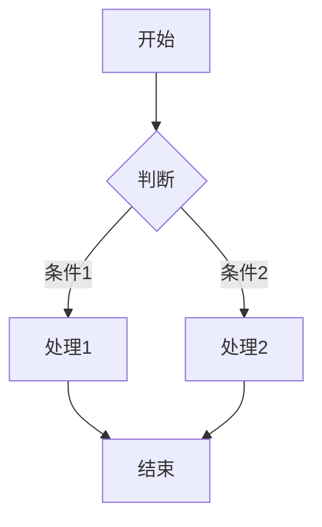
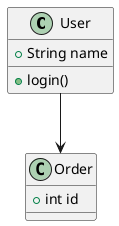

# MindFlow 用户文档

欢迎来到 MindFlow 用户文档！本文档将帮助你快速上手并充分利用 MindFlow 的所有功能。

## 目录

- [快速入门](#快速入门)
- [界面介绍](#界面介绍)
- [文件管理](#文件管理)
- [编辑器使用](#编辑器使用)
- [Markdown 语法](#markdown-语法)
- [扩展语法](#扩展语法)
- [快捷键列表](#快捷键列表)
- [导出功能](#导出功能)
- [演示模式](#演示模式)
- [主题设置](#主题设置)
- [配置说明](#配置说明)
- [常见问题](#常见问题)

---

## 快速入门

### 首次启动

1. **桌面端**: 安装后打开应用，首次启动会提示选择工作文件夹
2. **Web 端**: 访问 [https://md.mengbin.top](https://md.mengbin.top) 即可直接使用

### 基本工作流程

```
打开/创建文件夹 → 创建/选择文件 → 编辑内容 → 保存 → 导出（可选）
```

### 创建你的第一个文档

1. 按 `Cmd/Ctrl + O` 打开一个文件夹
2. 点击侧边栏的 "+" 按钮新建文件
3. 输入文件名（如 `hello.md`）
4. 在编辑器中输入 Markdown 内容
5. 按 `Cmd/Ctrl + S` 保存

---

## 界面介绍

MindFlow 采用经典的三栏布局设计：

```
┌──────────┬──────────┬─────────────────────────────┐
│          │          │                             │
│ 文件夹   │  文件    │      编辑器 + 预览           │
│  导航    │  列表    │                             │
│          │          │                             │
├──────────┤          ├─────────────────────────────┤
│   📁     │  📄      │  # Hello World              │
│  文档    │  note.md │                             │
│  图片    │  todo.md │  This is my first doc.      │
│  代码    │  ...     │                             │
│          │          │                             │
└──────────┴──────────┴─────────────────────────────┘
    左栏        中栏             右栏
```

### 左栏 - 文件夹导航

- 显示文件夹树结构
- 支持文件夹展开/折叠
- 右键点击文件夹可创建新文件/子文件夹
- 支持文件夹重命名和删除

### 中栏 - 文件列表

- 显示当前选中文件夹下的所有 Markdown 文件
- 点击文件即可打开编辑
- 支持文件搜索过滤
- 右键点击文件可操作（重命名、删除、复制路径）

### 右栏 - 编辑器 + 预览

- **编辑模式**: 纯编辑，无预览
- **预览模式**: 纯预览，不可编辑
- **分屏模式**: 左侧编辑，右侧预览（默认）
- **预览模式切换**: `Cmd/Ctrl + Shift + M`

---

## 文件管理

### 打开文件夹

| 方式 | 操作 |
|------|------|
| 快捷键 | `Cmd/Ctrl + O` |
| 菜单 | 文件 → 打开文件夹 |
| 拖放 | 将文件夹拖入应用窗口 |

### 创建文件

| 方式 | 操作 |
|------|------|
| 快捷键 | `Cmd/Ctrl + N` |
| 按钮 | 点击中栏顶部的 "+" 按钮 |
| 右键 | 在文件夹上右键 → 新建文件 |

**文件名规则**:
- 自动添加 `.md` 扩展名
- 支持子路径，如 `docs/guide/intro` 会自动创建子文件夹

### 重命名文件

1. 右键点击文件 → 重命名
2. 或选中文件后按 `F2`

### 删除文件

1. 右键点击文件 → 删除
2. 或选中文件后按 `Delete`
3. 确认删除后文件将进入回收站

### 文件搜索

- 快捷键: `Cmd/Ctrl + Shift + F`
- 支持文件名和文件内容搜索
- 支持正则表达式

---

## 编辑器使用

### 基础编辑

MindFlow 使用 CodeMirror 6 作为编辑器内核，提供类 IDE 的编辑体验：

- **语法高亮** - Markdown 语法自动高亮
- **自动补全** - 支持代码片段和路径补全
- **自动保存** - 可配置自动保存间隔
- **撤销/重做** - 支持无限撤销历史

### 光标操作

| 快捷键 | 功能 |
|--------|------|
| `Cmd/Ctrl + Home` | 跳到文档开头 |
| `Cmd/Ctrl + End` | 跳到文档结尾 |
| `Cmd/Ctrl + G` | 跳到指定行 |
| `Alt + 上下` | 移动当前行 |
| `Option/Alt + 点击` | 多光标编辑 |

### 选择操作

| 快捷键 | 功能 |
|--------|------|
| `Cmd/Ctrl + A` | 全选 |
| `Cmd/Ctrl + L` | 选中当前行 |
| `Cmd/Ctrl + D` | 选中下一个相同词 |
| `Cmd/Ctrl + Shift + L` | 选中所有相同词 |

---

## Markdown 语法

### 基础语法

```markdown
# 一级标题
## 二级标题
### 三级标题

**粗体文字**
*斜体文字*
~~删除线~~

- 无序列表项
- 另一个项
  - 子项

1. 有序列表
2. 第二项

[链接文本](https://example.com)


> 引用文本

`行内代码`

```language
代码块
```

| 表格 | 列2 |
|------|-----|
| 数据 | 数据 |

---
水平分割线
```

### 快捷键

| 快捷键 | 效果 |
|--------|------|
| `Cmd/Ctrl + B` | 粗体 |
| `Cmd/Ctrl + I` | 斜体 |
| `Cmd/Ctrl + K` | 插入链接 |
| `Cmd/Ctrl + Shift + I` | 插入图片 |
| `Cmd/Ctrl + Shift + B` | 代码块 |

---

## 扩展语法

### LaTeX 公式

MindFlow 支持 LaTeX 数学公式渲染：

**行内公式**:
```markdown
勾股定理：$a^2 + b^2 = c^2$
```

**块级公式**:
```markdown
$$
\int_{-\infty}^{\infty} e^{-x^2} dx = \sqrt{\pi}
$$
```

### Mermaid 图表

支持流程图、时序图、类图等：

```markdown

```

### PlantUML

专业 UML 图表：

```markdown

```

### Markmap 思维导图

将 Markdown 转为思维导图：

```markdown
```markmap
# 中心主题
## 分支1
- 子节点1
- 子节点2
## 分支2
- 子节点3
- 子节点4
```
```

---

## 快捷键列表

### 文件操作

| 快捷键 | 功能 |
|--------|------|
| `Cmd/Ctrl + N` | 新建文件 |
| `Cmd/Ctrl + O` | 打开文件夹 |
| `Cmd/Ctrl + S` | 保存文件 |
| `Cmd/Ctrl + Shift + S` | 另存为 |
| `Cmd/Ctrl + W` | 关闭当前文件 |
| `Cmd/Ctrl + Shift + T` | 重新打开关闭的文件 |

### 编辑操作

| 快捷键 | 功能 |
|--------|------|
| `Cmd/Ctrl + Z` | 撤销 |
| `Cmd/Ctrl + Shift + Z` | 重做 |
| `Cmd/Ctrl + X` | 剪切 |
| `Cmd/Ctrl + C` | 复制 |
| `Cmd/Ctrl + V` | 粘贴 |
| `Cmd/Ctrl + F` | 查找 |
| `Cmd/Ctrl + H` | 替换 |

### 视图操作

| 快捷键 | 功能 |
|--------|------|
| `Cmd/Ctrl + B` | 切换侧边栏 |
| `Cmd/Ctrl + Shift + M` | 切换编辑/预览模式 |
| `Cmd/Ctrl + =` | 放大字体 |
| `Cmd/Ctrl + -` | 缩小字体 |
| `Cmd/Ctrl + 0` | 重置字体大小 |
| `F11` | 全屏模式 |

### 导出与演示

| 快捷键 | 功能 |
|--------|------|
| `Cmd/Ctrl + Shift + E` | 导出文件 |
| `Cmd/Ctrl + Shift + P` | 演示模式 |
| `Cmd/Ctrl + Shift + F` | 搜索文件 |
| `Cmd/Ctrl + ,` | 打开设置 |

---

## 导出功能

MindFlow 支持多种格式导出：

### 导出方式

1. 快捷键: `Cmd/Ctrl + Shift + E`
2. 菜单: 文件 → 导出
3. 点击工具栏导出按钮

### 导出格式

| 格式 | 说明 | 适用场景 |
|------|------|----------|
| HTML | 带样式的 HTML 文件 | 网页展示 |
| PDF | 便携式文档 | 打印、分享 |
| PNG | 图片格式 | 社交媒体 |
| JPEG | 图片格式 | 压缩存储 |

### 导出选项

- **包含样式** - 是否包含 CSS 样式
- **代码高亮** - 代码块是否高亮
- **页面大小** - PDF 页面尺寸
- **图片质量** - PNG/JPEG 质量设置

---

## 演示模式

演示模式将 Markdown 转为幻灯片，适合演讲和分享。

### 进入演示模式

- 快捷键: `Cmd/Ctrl + Shift + P`
- 菜单: 视图 → 演示模式

### 幻灯片分隔

使用 `---` 分隔幻灯片：

```markdown
# 第一页

这是第一页内容

---

# 第二页

这是第二页内容
```

### 演示控制

| 操作 | 功能 |
|------|------|
| `→` / `↓` / `Space` | 下一页 |
| `←` / `↑` | 上一页 |
| `Esc` | 退出演示 |
| `F` | 全屏切换 |
| `O` | 概览模式 |

---

## 主题设置

### 切换主题

- 快捷键: `Cmd/Ctrl + Shift + L`
- 菜单: 视图 → 主题
- 设置面板: 外观 → 主题

### 可用主题

| 主题 | 描述 |
|------|------|
| Light | 浅色主题，适合白天使用 |
| Dark | 深色主题，适合夜间使用 |
| Auto | 跟随系统主题自动切换 |

### 字体设置

- **编辑器字体** - 代码编辑区域字体
- **预览字体** - 预览区域字体
- **界面字体** - UI 界面字体

推荐：编辑器使用 FiraCode 以获得最佳等宽体验

---

## 配置说明

### 打开设置

- 快捷键: `Cmd/Ctrl + ,`
- 菜单: 文件 → 首选项 → 设置

### 配置分类

#### 编辑器设置

| 配置项 | 说明 | 默认值 |
|--------|------|--------|
| 字体大小 | 编辑器字体大小 | 14px |
| 行高 | 行间距 | 1.6 |
| 自动保存 | 自动保存间隔 | 30秒 |
| 显示行号 | 是否显示行号 | 开启 |
| 自动换行 | 长行自动换行 | 开启 |
| Tab 宽度 | 缩进空格数 | 2 |

#### 预览设置

| 配置项 | 说明 | 默认值 |
|--------|------|--------|
| 同步滚动 | 编辑和预览同步滚动 | 开启 |
| 点击编辑 | 点击预览跳转编辑位置 | 开启 |
| 数学公式 | 启用 LaTeX 渲染 | 开启 |
| Mermaid | 启用 Mermaid 图表 | 开启 |

#### 导出设置

| 配置项 | 说明 | 默认值 |
|--------|------|--------|
| 默认格式 | 默认导出格式 | HTML |
| 包含样式 | 导出包含 CSS | 开启 |
| 代码高亮 | 导出代码高亮 | 开启 |

### 配置导入/导出

设置面板支持配置的导入和导出，方便在不同设备间同步设置：

1. 打开设置面板
2. 点击右上角 "..." 按钮
3. 选择导出配置或导入配置

---

## 常见问题

### 桌面端

**Q: 如何打开本地文件夹？**
A: 使用 `Cmd/Ctrl + O` 或菜单 文件 → 打开文件夹。

**Q: 文件保存在哪里？**
A: 文件保存在你打开的本地文件夹中，MindFlow 不会上传到任何服务器。

**Q: 支持哪些文件格式？**
A: 主要支持 `.md` 和 `.markdown` 文件，也可以打开纯文本文件。

**Q: 如何更新到最新版本？**
A: 桌面端支持自动更新，有新版本时会自动提示。也可以手动下载最新版本安装。

### Web 端

**Q: Web 端文件保存在哪里？**
A: Web 端使用浏览器的 File System Access API，文件保存在你选择的本地文件夹中。

**Q: Web 端支持哪些浏览器？**
A: 推荐使用 Chrome、Edge、Safari 最新版本。Firefox 部分功能受限。

**Q: 数据会同步到云端吗？**
A: 不会，所有数据都保存在本地，MindFlow 不会上传到任何服务器。

### 移动端

**Q: 如何同步桌面端文件？**
A: 可以使用 iCloud、Google Drive 等云同步服务同步文件夹。

**Q: 移动端支持离线编辑吗？**
A: 支持，移动端可以离线编辑本地文件。

### 功能相关

**Q: 如何插入图片？**
A: 使用 `` 语法，或直接粘贴图片。桌面端支持拖放图片。

**Q: 支持哪些图表类型？**
A: 支持 Mermaid（流程图、时序图、类图等）、PlantUML、Markmap（思维导图）。

**Q: 如何自定义快捷键？**
A: 目前不支持完全自定义快捷键，后续版本会考虑添加。

**Q: 遇到 Bug 怎么办？**
A: 请在 GitHub Issues 报告问题，提供详细的复现步骤和环境信息。

### 性能优化

**Q: 打开大文件卡顿怎么办？**
A: MindFlow 对大文件做了优化，但如果文件过大（>10MB），建议分割成多个文件。

**Q: 如何提升启动速度？**
A: 关闭不需要的扩展语法渲染，减少同时打开的文件数量。

---

## 获取帮助

如有其他问题，可以通过以下方式获取帮助：

- **GitHub Issues**: [提交问题](https://github.com/yourusername/mindflow/issues)
- **邮件联系**: support@mindflow.app
- **在线文档**: [https://md.mengbin.top/docs](https://md.mengbin.top/docs)

---

<p align="center">
  祝你写作愉快！📝
</p>
